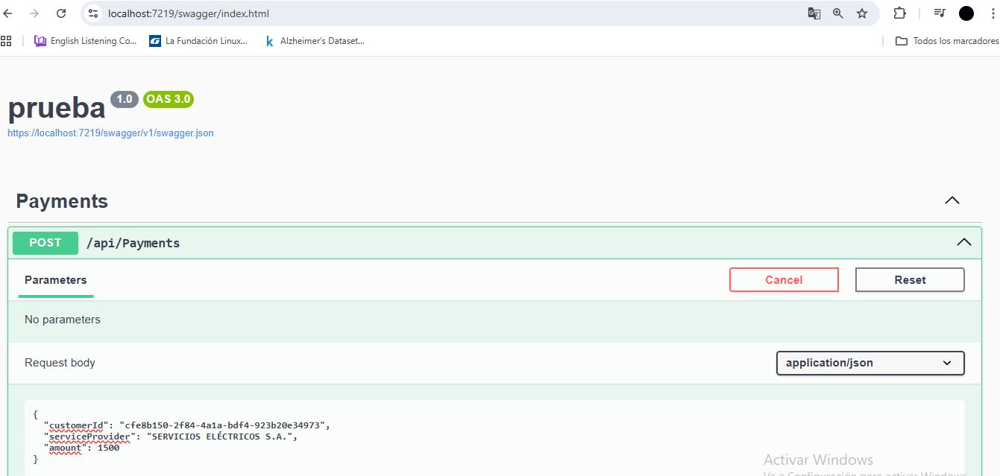
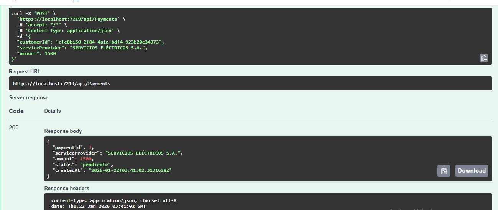
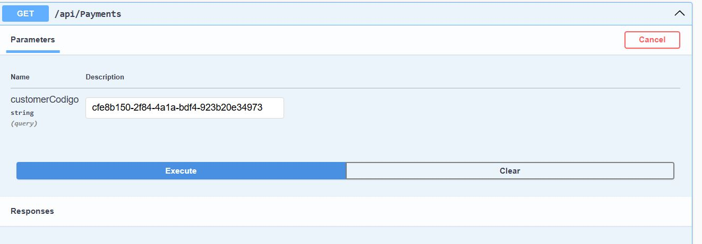
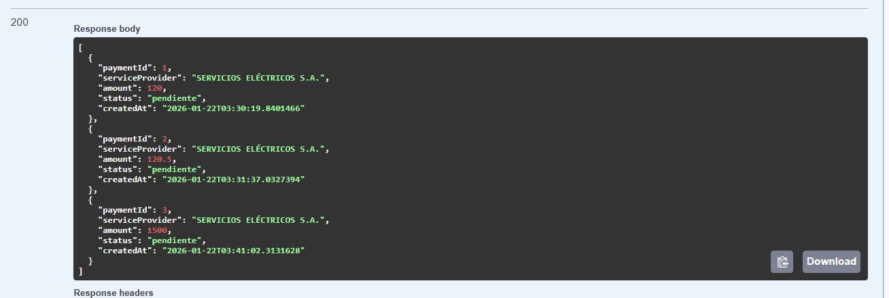
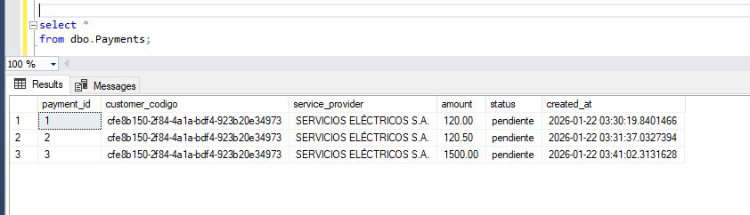

Payments API – .NET 8

API REST desarrollada en .NET 8 para el registro y consulta de pagos de servicios básicos como electricidad, agua y telecomunicaciones.
Proyecto realizado como prueba técnica aplicando buenas prácticas de desarrollo backend.

Contexto

La solución permite:

Registrar pagos realizados por clientes

Consultar pagos por cliente

Validar reglas de negocio (monto máximo, estado inicial, proveedor válido)

 Stack Tecnológico

.NET 8

ASP.NET Core Web API

Entity Framework Core

SQL Server (base de datos local)

Swagger / OpenAPI

📁 Estructura del Proyecto
PaymentsApi/
│── Controllers/        # Endpoints de la API
│── Data/               # DbContext y configuración EF Core
│── DTOs/               # Objetos de transferencia de datos
│── Models/             # Entidades de base de datos
│── appsettings.json    # Configuración de la aplicación
│── Program.cs
│── PaymentsApi.sln
│── README.md

## 🗄️ Diseño de Base de Datos

La base de datos está compuesta por tres tablas principales:

### customers
- customer_id (IDENTITY, PK)
- customer_codigo (varchar, único)
- first_name
- last_name
- document_number
- is_active
- created_at

### service_categories
- service_category_id (IDENTITY, PK)
- name (varchar, único)
- description
- is_active

### payments
- payment_id (IDENTITY, PK)
- customer_codigo (FK → customers.customer_codigo)
- service_provider (FK → service_categories.name)
- amount (decimal 10,2)
- status
- created_at

### 🔗 Relaciones

- Un cliente puede tener múltiples pagos
- Un pago pertenece a un cliente mediante `customer_codigo`
- Un pago pertenece a un proveedor de servicio mediante `service_provider`
## 📊 Datos de Ejemplo

La base de datos contiene datos de prueba para facilitar la validación del sistema.

Ejemplos:

### Cliente
- customer_codigo: `cfe8b150-2f84-4a1a-bdf4-923b20e34973`

### Proveedores de servicio
- SERVICIOS ELÉCTRICOS S.A.
- AGUA POTABLE S.A.
- TELECOMUNICACIONES S.A.
- GAS NATURAL S.A.

Ejecución del proyecto

La API se ejecutará en:

https://localhost:{puerto}

Swagger (Documentación)

Swagger está habilitado automáticamente.

Acceso desde el navegador:

https://localhost:{puerto}/swagger

Endpoints
➕ Registrar un pago

POST /api/payments

Request
{
  "customerCodigo": "cfe8b150-2f84-4a1a-bdf4-923b20e34973",
  "serviceProvider": "SERVICIOS ELÉCTRICOS S.A.",
  "amount": 120.50
}

Reglas de negocio

Estado inicial: pendiente

Monto máximo permitido: 1500 Bs

Solo moneda local (Bs)

Cliente y proveedor deben estar activos

📄 Consultar pagos por cliente

GET /api/payments?customerCodigo=cfe8b150-2f84-4a1a-bdf4-923b20e34973

Response
[
  {
    "paymentId": 1,
    "serviceProvider": "SERVICIOS ELÉCTRICOS S.A.",
    "amount": 120.50,
    "status": "pendiente",
    "createdAt": "2025-07-17T08:30:00Z"
  }
]

## Evidencia de funcionamiento

### Registro de pago (POST)

### Consulta de pagos (GET)

### Datos persistidos en base de datos

